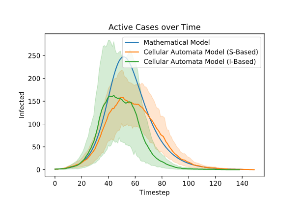
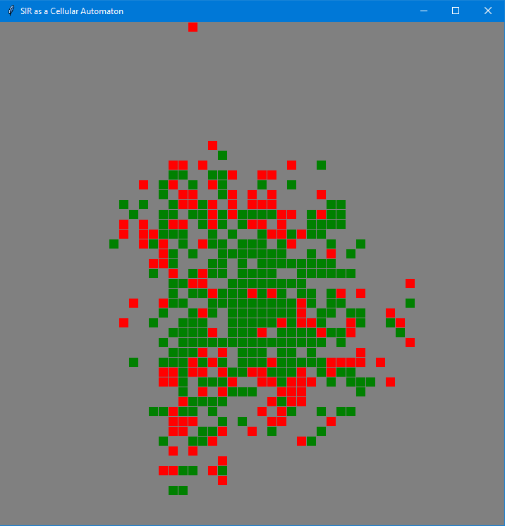

# Natural Computing Project
This repository contains all code used in the final project for the course NWI-IMC042 Natural Computing.

## Project Summary
In this project we compare a cellular automata implementation of the SIR model with its mathematical counterpart. We argue that the mathematical model has no regard for locality, i.e. every member of the population is assumed to be able to come in contact with every other member of the population. This is not a realistic model of the world around us. Instead, we propose to use Cellular Automata (CA) to implement the SIR model. We evaluate both implementations on the total number of infections, maximum number of infections at one point in time and the duration of the pandemic. This gives us insight in the models sensitivity in regard to locality. 

## Contents of this repository
To run the experiments described in our project report, simply run [experiment.ipynb](experiment.ipynb). Our implementation of the mathematical model can be found in [SIR.py](sir.py). Our CA implementation of the SIR model can be found in [grid.py](grid.py) and depends on [cell.py](cell.py). The CA model can be visualised using [main.py](main.py).

